<!--
  README de perfil — tema azul · SVGs animados próprios · dark/light automático
  Personalize em profile.json e rode:  npm run build
  Guia completo no final deste arquivo (seção "Como personalizar").
-->

<div align="center">

<picture>
  <source media="(prefers-color-scheme: dark)" srcset="assets/hero-dark.svg">
  <source media="(prefers-color-scheme: light)" srcset="assets/hero-light.svg">
  
</picture>

<br/>

<a href="https://github.com/kazukiwi?tab=followers"></a>
<a href="https://github.com/kazukiwi?tab=repositories"></a>


<br/><br/>

<sub><a href="#sobre">sobre</a> &nbsp;·&nbsp; <a href="#stack">stack</a> &nbsp;·&nbsp; <a href="#numeros">números</a> &nbsp;·&nbsp; <a href="#projetos">projetos</a> &nbsp;·&nbsp; <a href="#processo">processo</a> &nbsp;·&nbsp; <a href="#codigo">código</a> &nbsp;·&nbsp; <a href="#contato">contato</a></sub>

</div>

<br/>

<!-- ============================ 01 · SOBRE ============================ -->

<a id="sobre"></a>
<picture>
  <source media="(prefers-color-scheme: dark)" srcset="assets/h-sobre-dark.svg">
  <source media="(prefers-color-scheme: light)" srcset="assets/h-sobre-light.svg">
  
</picture>

<table>
<tr>
<td width="52%" valign="top">

<picture>
  <source media="(prefers-color-scheme: dark)" srcset="assets/terminal-dark.svg">
  <source media="(prefers-color-scheme: light)" srcset="assets/terminal-light.svg">
  
</picture>

</td>
<td width="48%" valign="top">

> [!NOTE]
> Construo software que une **boa engenharia** e **boa experiência**: código legível, sistemas observáveis e interfaces que não atrapalham ninguém.

- [x] Trabalhando em **projeto-alpha** (API + observabilidade)
- [x] Estudando **Rust**, **Kubernetes** e **IA generativa**
- [x] Contribuindo com projetos **open source**
- [ ] Escrever mais (os posts estão a caminho)

**Pergunte-me sobre:** `TypeScript` · `Python` · `Cloud` · `DevOps` · `IA`

<sub>Atalho favorito: <kbd>Ctrl</kbd> + <kbd>K</kbd> · Horário de pico: madrugada, com lo-fi</sub>

</td>
</tr>
</table>

<br/>

<!-- ============================ 02 · STACK ============================ -->

<a id="stack"></a>
<picture>
  <source media="(prefers-color-scheme: dark)" srcset="assets/h-stack-dark.svg">
  <source media="(prefers-color-scheme: light)" srcset="assets/h-stack-light.svg">
  
</picture>

<picture>
  <source media="(prefers-color-scheme: dark)" srcset="assets/stack-dark.svg">
  <source media="(prefers-color-scheme: light)" srcset="assets/stack-light.svg">
  
</picture>

<details>
<summary><b>Nível de proficiência</b> <sub>(clique para expandir)</sub></summary>

<br/>

```text
Python       ████████████████████░░░░   85%   2 anos
HTML         ██████████████████░░░░░░   78%   2 anos
CSS          ███████████████████░░░░░   82%   2 anos
SQL          ███████████████████░░░░░   80%   2 anos
JavaScript   ████████████████░░░░░░░░   70%   1 ano
PostgreSQL   ███████████████░░░░░░░░░   65%   1 ano
```

> [!TIP]
> Os valores são autoavaliação e refletem confiança para entregar em produção, não "quanto já li sobre o assunto".

</details>

<br/>

<!-- =========================== 03 · NÚMEROS =========================== -->

<a id="numeros"></a>
<picture>
  <source media="(prefers-color-scheme: dark)" srcset="assets/h-numeros-dark.svg">
  <source media="(prefers-color-scheme: light)" srcset="assets/h-numeros-light.svg">
  
</picture>

<picture>
  <source media="(prefers-color-scheme: dark)" srcset="assets/dashboard-dark.svg">
  <source media="(prefers-color-scheme: light)" srcset="assets/dashboard-light.svg">
  
</picture>

<br/>

<div align="center">

<picture>
  <source media="(prefers-color-scheme: dark)" srcset="https://raw.githubusercontent.com/kazukiwi/kazukiwi/output/snake-dark.svg">
  <source media="(prefers-color-scheme: light)" srcset="https://raw.githubusercontent.com/kazukiwi/kazukiwi/output/snake-light.svg">
  
</picture>

</div>

<sub>O painel é gerado por um script próprio (`scripts/stats.mjs`) usando a API GraphQL do GitHub, sem depender de serviços de terceiros que saem do ar.</sub>

<br/><br/>

<!-- =========================== 04 · PROJETOS ========================== -->

<a id="projetos"></a>
<picture>
  <source media="(prefers-color-scheme: dark)" srcset="assets/h-projetos-dark.svg">
  <source media="(prefers-color-scheme: light)" srcset="assets/h-projetos-light.svg">
  
</picture>

<table>
<tr>
<td width="50%">
<a href="https://github.com/kazukiwi/Projeto-AAPM-Harity">
<picture>
  <source media="(prefers-color-scheme: dark)" srcset="assets/project-1-dark.svg">
  <source media="(prefers-color-scheme: light)" srcset="assets/project-1-light.svg">
  
</picture>
</a>
</td>
<td width="50%">
<a href="https://github.com/kazukiwi/Projeto-MVC">
<picture>
  <source media="(prefers-color-scheme: dark)" srcset="assets/project-2-dark.svg">
  <source media="(prefers-color-scheme: light)" srcset="assets/project-2-light.svg">
  
</picture>
</a>
</td>
</tr>
<tr>
<td width="50%">
<a href="https://github.com/kazukiwi/Projeto-Apresenta--o-Textil">
<picture>
  <source media="(prefers-color-scheme: dark)" srcset="assets/project-3-dark.svg">
  <source media="(prefers-color-scheme: light)" srcset="assets/project-3-light.svg">
  
</picture>
</a>
</td>
</tr>
</table>

<br/>

<!-- =========================== 05 · PROCESSO ========================== -->

<a id="processo"></a>
<picture>
  <source media="(prefers-color-scheme: dark)" srcset="assets/h-processo-dark.svg">
  <source media="(prefers-color-scheme: light)" srcset="assets/h-processo-light.svg">
  
</picture>

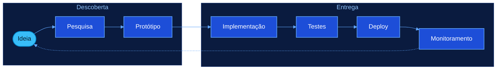

<details>
<summary><b>Linha do tempo</b></summary>

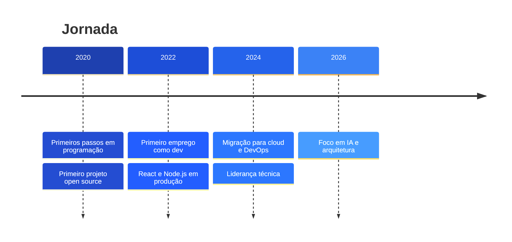

</details>

<details>
<summary><b>Fluxo de branches</b></summary>

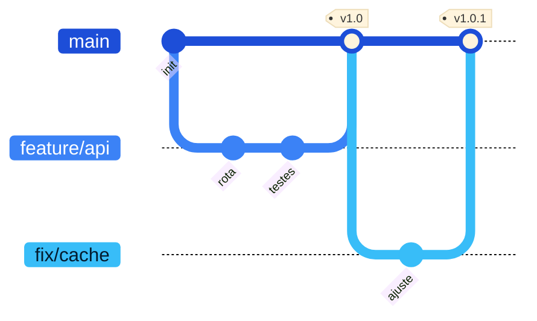

</details>

<br/>

<!-- ============================ 06 · CÓDIGO =========================== -->

<a id="codigo"></a>
<picture>
  <source media="(prefers-color-scheme: dark)" srcset="assets/h-codigo-dark.svg">
  <source media="(prefers-color-scheme: light)" srcset="assets/h-codigo-light.svg">
  
</picture>

```typescript
// principios.ts
export const principios = {
  clareza: "código é lido muito mais vezes do que é escrito",
  testes: "documentação que nunca fica desatualizada",
  simplicidade: "a solução mais simples que resolve o problema",
  medir: "otimizar só depois de medir",
} as const;

export function entregar(feature: Feature): Result {
  return pipeline(feature, [revisar, testar, publicar, observar]);
}
```

A ideia, em forma de equação[^1]:

$$
\text{Impacto} = \frac{\text{Clareza} \times \text{Colaboração}}{\text{Complexidade desnecessária}} + \sum_{i=1}^{n} \text{Aprendizado}_i
$$

> [!TIP]
> Na dúvida, escreva o código mais simples que funcione. Dá para otimizar depois, com dados na mão.

> [!IMPORTANT]
> Testes não são opcionais: são o que permite mudar o código sem medo.

> [!WARNING]
> Otimização prematura é a raiz de muitos males (e de muitos bugs).

[^1]: Brincadeira séria: os termos não são mensuráveis, mas a intuição vale como bússola.

<br/>

<!-- ============================ BLOG (opcional) ======================= -->

<!-- BLOG-POST-LIST:START -->
<!-- BLOG-POST-LIST:END -->

<!-- =========================== 07 · CONTATO =========================== -->

<a id="contato"></a>
<picture>
  <source media="(prefers-color-scheme: dark)" srcset="assets/h-contato-dark.svg">
  <source media="(prefers-color-scheme: light)" srcset="assets/h-contato-light.svg">
  
</picture>

<div align="center">

<a href="https://linkedin.com/in/kazuki-shiroma"><picture>
  <source media="(prefers-color-scheme: dark)" srcset="assets/btn-linkedin-dark.svg">
  <source media="(prefers-color-scheme: light)" srcset="assets/btn-linkedin-light.svg">
  
</picture></a>
&nbsp;
<a href="mailto:kazukishiroma06@gmail.com"><picture>
  <source media="(prefers-color-scheme: dark)" srcset="assets/btn-email-dark.svg">
  <source media="(prefers-color-scheme: light)" srcset="assets/btn-email-light.svg">
  
</picture></a>
&nbsp;
<a href="https://harity-tecnology-inc.onrender.com/"><picture>
  <source media="(prefers-color-scheme: dark)" srcset="assets/btn-site-dark.svg">
  <source media="(prefers-color-scheme: light)" srcset="assets/btn-site-light.svg">
  
</picture></a>
&nbsp;

<br/><br/>

<sub><i>Os melhores projetos nascem de boas conversas.</i></sub>

</div>

<br/>

<details>
<summary><b>Como personalizar este perfil</b> <sub>(pode apagar esta seção depois)</sub></summary>

<br/>

1. **Crie o repositório do perfil**: um repositório público com o *mesmo nome* do seu usuário (`SEU-USUARIO/SEU-USUARIO`) e suba todos estes arquivos.
2. **Edite `profile.json`**: nome, status, cargos que aparecem digitando, stack, projetos, links e as falas do terminal.
3. **Regere os SVGs** com Node 18 ou superior (não precisa instalar nada):
   ```bash
   npm run build          # hero, cabeçalhos, stack, projetos, botões e rodapé
   npm run stats:mock     # painel de números com dados de exemplo
   ```
4. **Troque os textos** do `README.md`: substitua `SEU-USUARIO` e `seu@email.com` pelos seus dados (busca e substituição resolve).
5. **Ative os workflows** em *Settings → Actions → General → Workflow permissions → Read and write*, depois rode cada um uma vez em *Actions → Run workflow*:
   - `stats.yml` atualiza o painel com seus dados reais a cada 8 horas;
   - `snake.yml` gera a cobrinha na branch `output`;
   - `blog.yml` (opcional) preenche a lista de posts, se você tiver um feed RSS.

> [!NOTE]
> O painel só enxerga contribuições públicas (e as privadas, se você ativar "Private contributions" no perfil). Os SVGs usam apenas fontes do sistema, então o visual pode variar um pouco entre Windows, macOS e Linux.

</details>

<br/>

<picture>
  <source media="(prefers-color-scheme: dark)" srcset="assets/footer-dark.svg">
  <source media="(prefers-color-scheme: light)" srcset="assets/footer-light.svg">
  
</picture>
